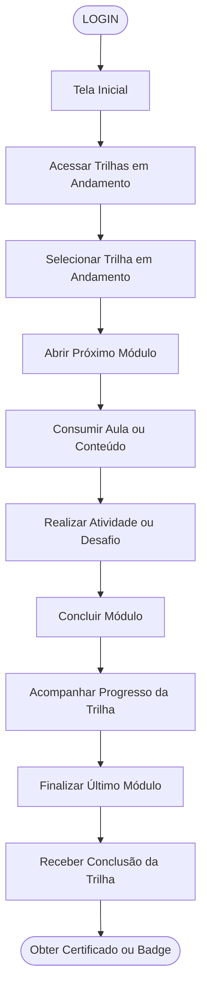

# Jornadas dos Usuários

## Mapeamento da Jornada do Usuário

Documento com os fluxos principais das jornadas selecionadas para o Pathly.

---

## 1. Criar uma Trilha

---

## 2. Concluir Trilha em Andamento

