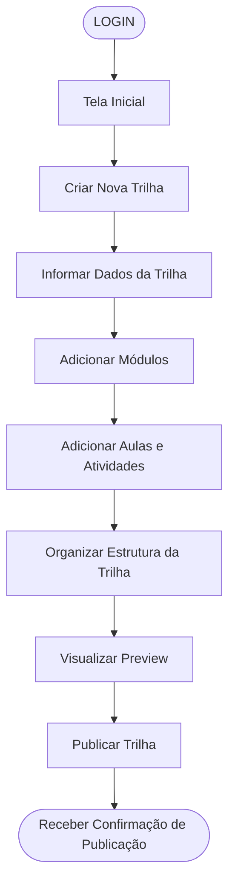

# Jornadas dos Usuários

# Mapeamento da Jornada do Usuário

Documento com os fluxos principais das jornadas selecionadas para o Pathly.

---

## 1. Fluxo da Interação: Criar uma Trilha

**Objetivo do usuário:** criar e publicar uma nova trilha de aprendizado no Pathly.

**Tipo de usuário:** Criador

### Etapas resumidas

1. Login
2. Tela Inicial
3. Criar Nova Trilha
4. Informar dados da trilha
5. Adicionar módulos
6. Adicionar aulas e atividades
7. Organizar estrutura da trilha
8. Visualizar preview
9. Publicar trilha
10. Receber confirmação de publicação

---

## 2. Fluxo da Interação: Concluir Trilha em Andamento

**Objetivo do usuário:** retomar uma trilha já iniciada, concluir os módulos restantes e receber a conclusão da trilha.

**Tipo de usuário:** Aluno

### Etapas resumidas

1. Login
2. Tela Inicial
3. Acessar trilhas em andamento
4. Selecionar trilha em andamento
5. Abrir próximo módulo
6. Consumir aula ou conteúdo
7. Realizar atividade ou desafio
8. Concluir módulo
9. Acompanhar progresso da trilha
10. Finalizar último módulo
11. Receber conclusão da trilha
12. Obter certificado ou badge

---