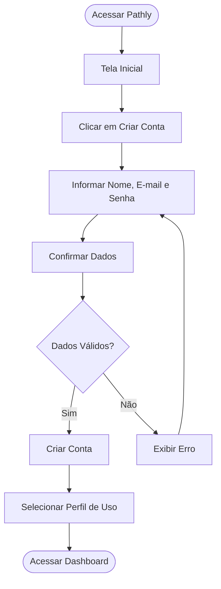
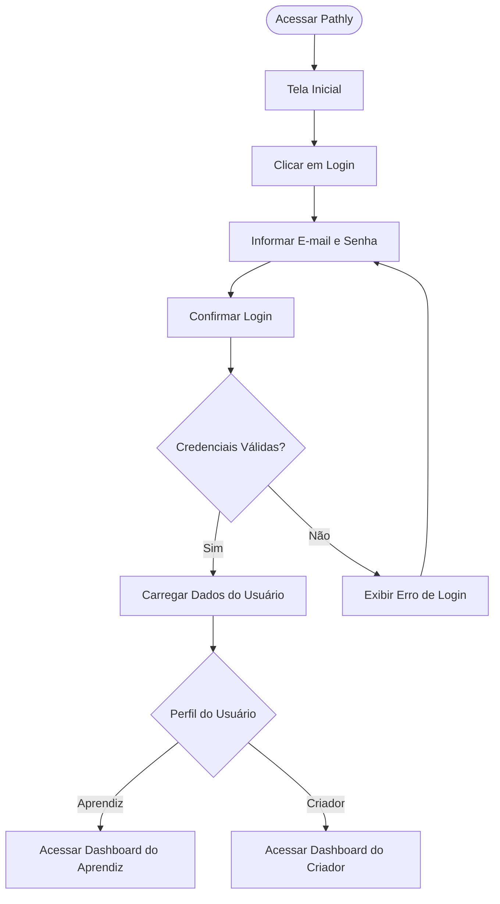
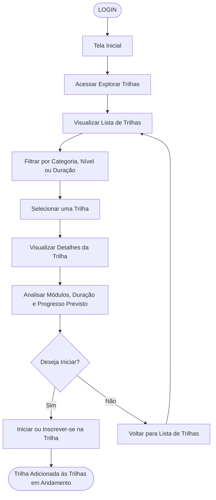

# Mapeamento da Jornada do Usuário

> Documento com os fluxos principais das jornadas selecionadas para o Pathly.

# Ambos

Jornadas que podem ser realizadas tanto por usuários do tipo Aprendiz quanto por usuários do tipo Criador.

## 1. Fluxo da Interação: Criar Conta

**Objetivo do usuário:** criar uma conta no Pathly para acessar a plataforma, salvar dados e utilizar recursos conforme seu perfil.

**Tipo de usuário:** Aprendiz, Criador

### Etapas resumidas

1. Acessar Pathly
2. Tela Inicial
3. Clicar em Criar Conta
4. Informar nome, e-mail e senha
5. Confirmar dados
6. Validar dados
7. Criar conta
8. Selecionar perfil de uso
9. Acessar dashboard

## 2. Fluxo da Interação: Fazer Login

**Objetivo do usuário:** acessar uma conta já existente para retomar suas atividades no Pathly.

**Tipo de usuário:** Aprendiz, Criador

### Etapas resumidas

1. Acessar Pathly
2. Tela Inicial
3. Clicar em Login
4. Informar e-mail e senha
5. Confirmar login
6. Validar credenciais
7. Carregar dados do usuário
8. Direcionar para dashboard conforme perfil

# Aprendiz

Jornadas relacionadas ao consumo de trilhas, avanço no aprendizado e acompanhamento de progresso.

## 3. Fluxo da Interação: Explorar Trilhas Disponíveis

**Objetivo do usuário:** encontrar uma trilha de aprendizado relevante para iniciar ou visualizar detalhes antes de se inscrever.

**Tipo de usuário:** Aprendiz

### Etapas resumidas

1. Login
2. Tela Inicial
3. Acessar Explorar Trilhas
4. Visualizar lista de trilhas
5. Filtrar por categoria, nível ou duração
6. Selecionar uma trilha
7. Visualizar detalhes da trilha
8. Analisar módulos, duração e progresso previsto
9. Decidir se deseja iniciar
10. Iniciar ou inscrever-se na trilha
11. Trilha adicionada às trilhas em andamento

## 4. Fluxo da Interação: Concluir Trilha em Andamento

**Objetivo do usuário:** retomar uma trilha já iniciada, concluir os módulos restantes e receber a conclusão da trilha.

**Tipo de usuário:** Aprendiz

### Etapas resumidas

1. Login
2. Tela Inicial
3. Acessar trilhas em andamento
4. Selecionar trilha em andamento
5. Abrir próximo módulo
6. Consumir aula ou conteúdo
7. Realizar atividade ou desafio
8. Concluir módulo
9. Acompanhar progresso da trilha
10. Finalizar último módulo
11. Receber conclusão da trilha
12. Obter certificado ou badge

# Criador

Jornadas relacionadas à criação, organização e publicação de trilhas de aprendizado.

## 5. Fluxo da Interação: Criar uma Trilha

**Objetivo do usuário:** criar e publicar uma nova trilha de aprendizado no Pathly.

**Tipo de usuário:** Criador

### Etapas resumidas

1. Login
2. Tela Inicial
3. Criar Nova Trilha
4. Informar dados da trilha
5. Adicionar módulos
6. Adicionar aulas e atividades
7. Organizar estrutura da trilha
8. Visualizar preview
9. Publicar trilha
10. Receber confirmação de publicação
